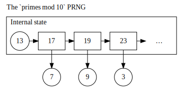

.. _ref_introduction:

============
Introduction
============

Computer systems often need to produce random behaviour. Computer game enemies need to
walk in unpredictable directions; cryptosystems need unpredictable keys and nonces; Monte
Carlo simulations need random values.

Producing sequences of truly random numbers from a computer isn't easy. Computers are
intended as quite regularised, deterministic machines. With care we can obtain true random
sequences from `quantum fluctuations <https://qrng.anu.edu.au>`_,
`radio noise <https://www.random.org>`_, `lava lamps <https://en.wikipedia.org/wiki/Lavarand>`_
and `many other sources <https://en.wikipedia.org/wiki/Hardware_random_number_generator>`_.
However most of these don't fit easily into a computer, or provide a low rate of random bits.

PCs extract random data from noise on analog inputs (e.g., audio), timings of thread switching
and hard drive behaviour, and your mouse movements. However a HTTPS webserver needs some random
data for every connection; for busy websites this is far beyond what can be obtained without a
specialised Hardware Random Number Generator. But we can use algorithms to make what entropy
we have stretch further.

_________
Sequences
_________

Consider the following sequence of numbers:

.. raw:: html

   
<i>2, 3, 5, 7, 11, 13, …</i>

Several clues suggest this is a sequence of prime numbers: only 2 is even, composite 9 was not
included. As such we can reason the rule for the next value in the sequence is, "the next
largest prime number." So this sequence was quite predictable.

The Challenge when making an algorithm to generate numbers that, "seem random," is to make the
next value in the sequence non-obvious. There are many ways to do this: for prime numbers one
could just keep the final digit. This is the essence of a **pseudorandom sequence**: it seems random,
but there's actually an algorithm generating the sequence rather than truly random events.

.. raw:: html

   
<i>2, 3, 5, 7, 1, 3, …</i>

The `2, 3, 5, 7` sequence is still recognisable, as is that 2 remains the only even number in
the sequence. However if we skipped those primes < 10, it starts to take thought. Then there are
various ways we can map this sequence to one with even values.

---------------------
Visualising sequences
---------------------

A large sequence of random numbers shouldn't show clear patterns when visualised. It can - a random
sequence of sufficient (huge) length becomes likely to include `1, 2, 3, …, 100` - but that should
be a random abberation in the pattern.

A pseudorandom sequence, one that seems random, should mimic a random sequence. Thus it too shouldn't
show clear patterns when visualised. As there is an algorithm at work, sufficient analysis may be able
to discover the underlying pattern and predict future/past values, but it should not be trivially
obvious.

In the following charts, a pseudorandom sequence should look like atmospheric noise on an untuned TV screen.

.. note::
   The relationship between each number in the sequence and how large they are.

   .. raw:: html

      
<code>pointi= (xi, yi, intensityi) = (i mod width, i / width, outputi)</code>

   .. raw:: html

         <canvas class="numbers-noise-plot" id="numbers-noise-primes" width=200" height="225" data-plot-name="Prime numbers" data-numbers-path="_static/numbers/65536-primes.txt" style="display: inline-block;"></canvas>
         <canvas class="numbers-noise-plot" id="numbers-noise-prime-digits" width=200" height="225" data-plot-name="Primes mod 10" data-numbers-path="_static/numbers/65536-prime-digits.txt" style="display: inline-block;"></canvas>
         <canvas class="numbers-noise-plot" id="numbers-noise-python-random-mersenne" width="200" height="225" data-plot-name="Mersenne Twister (Python)" data-numbers-path="_static/numbers/65536-python-random-mersenne.txt"></canvas>
         <canvas class="numbers-noise-plot" id="numbers-noise-python-systemrandom" width=200" height="225" data-plot-name="High-quality PRNG (Yarrow)" data-numbers-path="_static/numbers/65536-python-systemrandom.txt"></canvas>

   The primes grow over time, so there's a very clear smooth pattern. But the `primes mod 10` look really
   good!

.. note::
   The relationship between a number and the successive number.

   .. raw:: html

      
<code>pointi= (xi, yi, intensityi) = (outputi mod width, outputi+1 mod height, i)</code>

   .. raw:: html

         <canvas class="numbers-noise-coord-plot" id="numbers-noise-coord-primes" width="200" height="225" data-plot-name="Prime numbers" data-numbers-path="_static/numbers/65536-primes.txt"></canvas>
         <canvas class="numbers-noise-coord-plot" id="numbers-noise-coord-prime-digits" width="200" height="225" data-plot-name="Primes mod 10" data-numbers-path="_static/numbers/65536-prime-digits.txt"></canvas>
         <canvas class="numbers-noise-coord-plot" id="numbers-noise-coord-python-random-mersenne" width="200" height="225" data-plot-name="Mersenne Twister (Python)" data-numbers-path="_static/numbers/65536-python-random-mersenne.txt"></canvas>
         <canvas class="numbers-noise-coord-plot" id="numbers-noise-coord-python-systemrandom" width=200" height="225" data-plot-name="High-quality PRNG (Yarrow)" data-numbers-path="_static/numbers/65536-python-systemrandom.txt"></canvas>
         <canvas class="numbers-noise-coord-plot" id="numbers-noise-coord-randu" width=200" height="225" data-plot-name="RANDU" data-numbers-path="_static/numbers/65536-randu.txt"></canvas>

   Primes came out quite pretty, but we're not doing Number Theory. Our `primes mod 10` look far more
   structured than in the previous plot. Why?

   * Limited output range.
      * Once past 10, `primes mod 10` can only end with 1, 3, 7 or 9.
      * Each black box corresponds to a prime being followed by a prime ending with 1, 3, 7 or 9.
      * The grey boxes indicate the opening (2, 3), (3, 5) and (5, 7) pairs.
   * Besides those <10, the mappings happen almost evenly. `Number Theorists actively research this. <http://www.nature.com/news/peculiar-pattern-found-in-random-prime-numbers-1.19550>`_
      * There are practical problems with using `primes mod 10` as a pseudorandom sequence, else it might
        could work. Chief among these is the increasing computation time and memory usage for finding
        larger and larger primes.

_______________________________
Pseudo-Random Number Generators
_______________________________

We've discussed pseudorandom sequences, and invented a way to produce one from the prime numbers. Now
we'll briefly discuss the algorithms that generate the sequences, and you'll be playing with one for
the first exercise.

The algorithms are called Pseudo-Random Number Generators (PRNGs). As mentioned above, *pseudorandom*
refers to numbers being generated by an algorithm but being designed to appear as if generated by a
truly random process. The mathematics used vary a lot - the one we'll use first is based in binary
fields and linear functions, whereas some we'll encounter later are based upon ideas in cryptography.
Some store a few bytes of internal state, others have kilobytes. But their basic designs share many
similarities.

.. image:: _images/prng.svg

The generator receives a seed value and transforms that into its internal state. For some PRNGs
that might mean a sequence of bit operations, for others it might involve a step akin to encryption.

Then the generator outputs a value. This is transformed from the internal state, again by some sort
of obfuscation routine. Then the generator calculates the next internal state - and so forth.

.. _ref_objectives:

___________________
Aims and Objectives
___________________

The objective of this experiment is to:

* Understand that random number generation is important in many contexts.
* Show it is possible to attack security systems using non-cryptographically-secure
  PRNGs.
* Show that it is possible to attack systems using CSPRNGs if it is used in an insecure manner,
  e.g. poor Seeding.
* Investigate patterns in random number generation output.

.. _ref_prerequisites:

_____________________________________
Prerequisites, Equipment and Software
_____________________________________

This experiment requires the ability to write small programs in Python. You will also
need to make basic use of the Linux command line to run your program and the Usemin
file monitor to manage and edit files.  (see Virtual Machine documentation).

.. _ref_ethics:

______________
Ethical Issues
______________

There are no specific ethical issues in conducting the experiment.

As is common in security teaching, the techniques described here could be used to
attack systems but you must behave responsibly and ethically toward other people,
their data and systems. The writing or use of tools to gain unauthorised access
to systems is a criminal offence.
