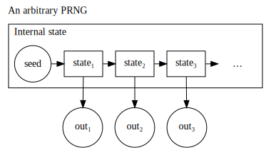

.. _ref_introduction:

============
Introduction
============

Computer systems often need to produce random behaviour. Computer game enemies need to
walk in unpredictable directions; cryptosystems need unpredictable keys and nonces; Monte
Carlo simulations need random values.

Producing sequences of truly random numbers from a computer isn't easy. Computers are
intended as quite regularised, determistic machines. With care we can obtain true random
sequences from quantum fluctuations, radio noise, lava lamps, unstable electronic circuits
and many other sources. However most of these don't normally belong in a computer or are hard to
extract sufficient numbers from.

From things like noise on analog inputs and timings of thread switching and hard drive behaviour,
PCs can obtain some entropy. However this obtained data tends to be quite small. If you're running
a popular HTTPS website you need a lot of random numbers, far more than each server can generate
from those sources. Thus we use algorithms to make that entropy go further.

_________
Sequences
_________

Consider the following sequence of numbers:

.. raw:: html

   
<i>2, 3, 5, 7, 11, 13, …</i>

Several clues suggest this is a sequence of prime numbers: only 2 is even, composite 9 was not
included. As such we can reason the rule for the next value in the sequence is, "the next
largest prime number." So this sequence was quite predictable.

The Challenge when making an algorithm to generate numbers that, "seem random," is to make the
next value in the sequence non-obvious. There are many ways to do this: for prime numbers one
could just keep the final digit.

.. raw:: html

   
<i>2, 3, 5, 7, 1, 3, …</i>

The `2, 3, 5, 7` sequence is still recognisable, as is that 2 remains the only even number in
the sequence. However if we skipped those primes < 10, it starts to take thought. There are also
various ways we could map this sequence to one with even values.

As we obfuscate the prime sequence more and more, the outputs are less distinctive and more
unpredictable. This is not a PRNG in common usage but it gives a sense

What is happening here is less immediately obvious. Without a longer sequence and a flash of
insight we probably wouldn't even consider prime numbers.

---------------------
Visualising sequences
---------------------

A reasonable quality PRNG should show limited patterns from visualising its output. A good PRNG should show no pattern, at least without in-depth analysis. For the following charts, a good random or pseudorandom sequence should look like atmospheric noise on an untuned TV screen.

.. note::
   Plotting magnitude of numbers.

   .. raw:: html

      
<code>pointi= (xi, yi, intensityi) = (i mod width, i / width, outputi)</code>

   .. raw:: html

         <canvas class="numbers-noise-plot" id="numbers-noise-primes" width=200" height="225" data-plot-name="Prime numbers" data-numbers-path="_static/numbers/65536-primes.txt" style="display: inline-block;"></canvas>
         <canvas class="numbers-noise-plot" id="numbers-noise-prime-digits" width=200" height="225" data-plot-name="Prime numbers mod 10" data-numbers-path="_static/numbers/65536-prime-digits.txt" style="display: inline-block;"></canvas>
         <canvas class="numbers-noise-plot" id="numbers-noise-python-systemrandom" width=200" height="225" data-plot-name="High-quality PRNG" data-numbers-path="_static/numbers/65536-python-systemrandom.txt"></canvas>

   The sequence of primes gets larger over time, so as their values increase the chart gets darker, but
   the primes mod 10 do look quite like we might hope.

.. note::
   Plotting pairs of numbers.

   .. raw:: html

      
<code>pointi= (xi, yi, intensityi) = (outputi mod width, outputi+1 mod height, i)</code>

   .. raw:: html

         <canvas class="numbers-noise-coord-plot" id="numbers-noise-coord-primes" width="200" height="225" data-plot-name="Prime numbers" data-numbers-path="_static/numbers/65536-primes.txt"></canvas>
         <canvas class="numbers-noise-coord-plot" id="numbers-noise-coord-prime-digits" width="200" height="225" data-plot-name="Prime numbers mod 10" data-numbers-path="_static/numbers/65536-prime-digits.txt"></canvas>
         <canvas class="numbers-noise-coord-plot" id="numbers-noise-coord-python-systemrandom" width=200" height="225" data-plot-name="High-quality PRNG" data-numbers-path="_static/numbers/65536-python-systemrandom.txt"></canvas>

   Primes show a quite beautiful pattern, but that's more of a matter for Number Theorists. Our primes mod 10 aren't at all like the high-quality PRNG. Why?

   No prime >10 ends with 5. Thus the only 4 digits that can be output are 1, 3, 7 and 9. Each of these
   digits is theorised to be mapped to each other quite evenly [@TODO: try to distill down the number
   theory, or skip?] but there remains only a few output values.

_______________________________
Pseudo-Random Number Generators
_______________________________

These algorithms for generating 'random' sequences of numbers are named Pseudo-Random Number
Generators (PRNGs). *Pseudo-random* refers to the numbers not actually being generated by a
random process. The details of how these algorithms work vary a lot. Some have a few bytes of
data stored, others have kilobytes. Some we'll encounter later are engineered to be a very hard
problem to predict. But a good depiction of their structure follows.

The generator receives a seed value and transforms that into its internal state. For some PRNGs
that might mean a sequence of bit operations, for others it might involve a step akin to encryption.

Then the generator outputs a value. This is transformed from the internal state, again by some sort
of obfuscation routine. Then the generator calculates the next internal state - and so forth.

-----

[@TODO: http://crypto.stackexchange.com/questions/12436/what-is-the-difference-between-csprng-and-prng
first comment contains a useful way of explaining PRNG internal state.]

A reasonable quality PRNG should show limited patterns from visualising its output. A good PRNG (and especially CSPRNGs) should show no patterns, at least without in-depth analysis.

Taking outputs and sequentially plotting their intensities on a graph should look like an untuned TV. Here I've plotted a sequence of primes, so as their values increase the chart gets darker.

.. raw:: html

   <canvas class="numbers-noise-plot" id="numbers-noise-lcg" width="200" height="225" data-plot-name="LCG" data-numbers-path="_static/numbers/65536-lcg.txt"></canvas>
   <canvas class="numbers-noise-plot" id="numbers-noise-lcg-prime" width="200" height="225" data-plot-name="LCG with Prime params" data-numbers-path="_static/numbers/65536-lcg-prime.txt"></canvas>
   <canvas class="numbers-noise-plot" id="numbers-noise-randu" width="200" height="225" data-plot-name="RANDU" data-numbers-path="_static/numbers/65536-randu.txt"></canvas>
   <canvas class="numbers-noise-plot" id="numbers-noise-python-random-mersenne" width="200" height="225" data-plot-name="Python random (Mersenne)" data-numbers-path="_static/numbers/65536-python-random-mersenne.txt"></canvas>
   <canvas class="numbers-noise-plot" id="numbers-noise-python-systemrandom" width="200" height="225" data-plot-name="/dev/urandom (Mac, Yarrow)" data-numbers-path="_static/numbers/65536-python-systemrandom.txt"></canvas>

Coordinate plots (x, y) = (output i, output i+1):

.. raw:: html

   <canvas class="numbers-noise-coord-plot" id="numbers-noise-coord-lcg" width="200" height="225" data-plot-name="LCG" data-numbers-path="_static/numbers/65536-lcg.txt"></canvas>
   <canvas class="numbers-noise-coord-plot" id="numbers-noise-coord-lcg-prime" width="200" height="225" data-plot-name="LCG with Prime params" data-numbers-path="_static/numbers/65536-lcg-prime.txt"></canvas>
   <canvas class="numbers-noise-coord-plot" id="numbers-noise-coord-randu" width="200" height="225" data-plot-name="RANDU" data-numbers-path="_static/numbers/65536-randu.txt"></canvas>
   <canvas class="numbers-noise-coord-plot" id="numbers-noise-coord-python-random-mersenne" width="200" height="225" data-plot-name="Python random (Mersenne)" data-numbers-path="_static/numbers/65536-python-random-mersenne.txt"></canvas>
   <canvas class="numbers-noise-coord-plot" id="numbers-noise-coord-python-systemrandom" width="200" height="225" data-plot-name="/dev/urandom (Mac, Yarrow)" data-numbers-path="_static/numbers/65536-python-systemrandom.txt"></canvas>

3D phase space (delayed coordinate) plots:

.. raw:: html

   <!--

   

   

   

-->
   

   <!--

   

-->

Coordinate plots (x, y, z) = (output i, output i+1, output i+2):

.. raw:: html

   <!--

   

   

   

   

   

   

   

   

-->

It is important to remember that PRNG outputs are related. The algorithm's internal state is
generating each number, and while the output routine might obfuscate the relation it still did arise
from this process.

.. _ref_objectives:

___________________
Aims and Objectives
___________________

The objective of this experiment is to:

* Understand that random number generation is important in many contexts.
* Show it is possible to attack security systems using non-cryptographically-secure
  PRNGs.
* Show that it is possible to attack systems using CSPRNGs if it is used in an insecure manner,
  e.g. poor Seeding.
* Investigate patterns in random number generation output.

.. _ref_prerequisites:

_____________________________________
Prerequisites, Equipment and Software
_____________________________________

This experiment requires the ability to write small programs in Python. You will also
need to make basic use of the Linux command line to run your program and the Usemin
file monitor to manage and edit files.  (see Virtual Machine documentation).

.. _ref_ethics:

______________
Ethical Issues
______________

There are no specific ethical issues in conducting the experiment.

As is common in security teaching, the techniques described here could be used to
attack systems but you must behave responsibly and ethically toward other people,
their data and systems. The writing or use of tools to gain unauthorised access
to systems is a criminal offence.

